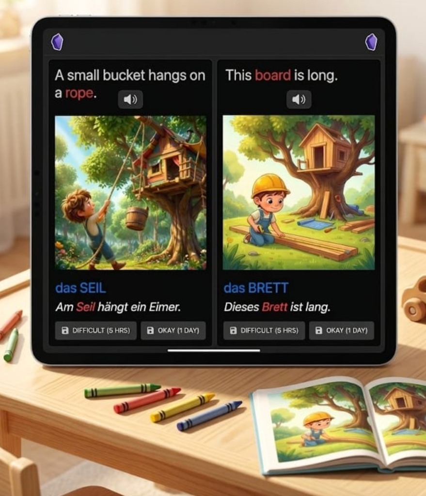
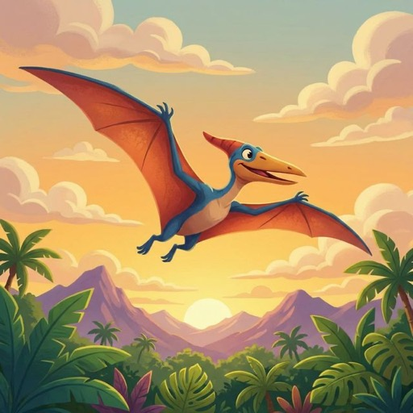
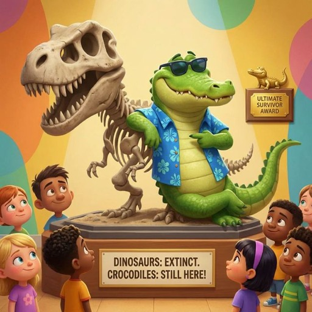
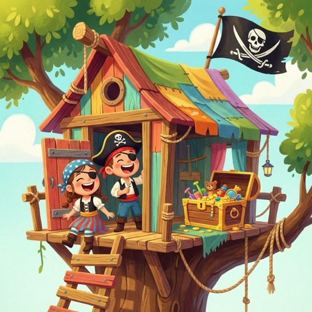
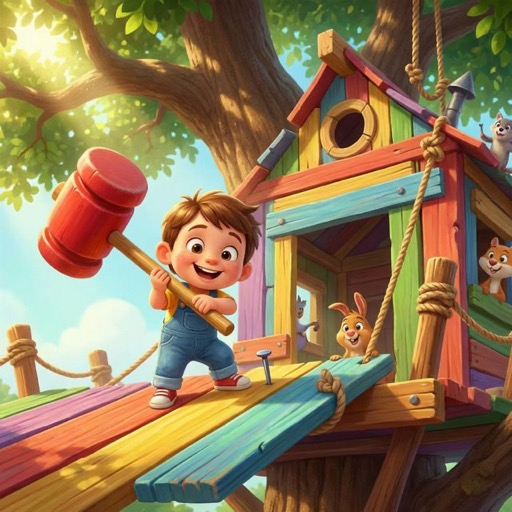
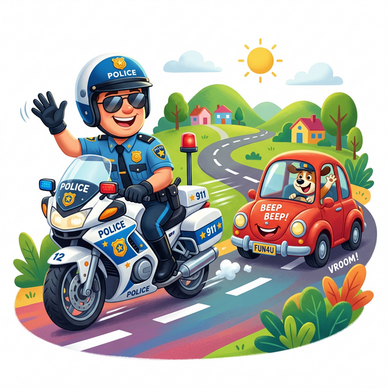
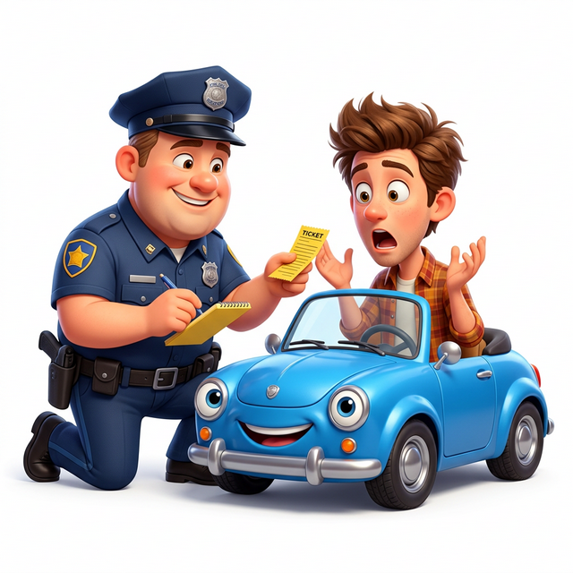

# AI-Language-Flashcards

> **Obsidian flashcards for children learning German — powered by spaced repetition.**

<p align="center">
  
</p>

A ready-to-use Obsidian vault with illustrated German vocabulary flashcards for kids. Cards appear automatically at the right time thanks to the **AOSR** (Another Obsidian Spaced Repetition) plugin, so even 10 minutes a day adds up to solid vocabulary gains.

---

## Preview

<p align="center">
  
  
  
  
  
  
</p>

Each card shows a fun illustrated scene on the front with an English sentence and audio. Flip it over to see the German word — colour-coded by syllable — plus a full German sentence with pronunciation audio.

---

## Who is this for?

- Kids aged **7–11** who already know some German basics (simple words, alphabet)
- Parents or teachers looking for a low-effort, high-quality daily practice routine
- Works great on a **tablet** — tested with Obsidian on android tablet

---

## What's included

| Set | Topic | Cards |
|-----|-------|-------|
| `germanVocabulary_01_dino.md` | Dinosaurs 🦕 | 16 |
| `germanVocabulary_02_treehouse.md` | Building a treehouse 🌳 | 20 |
| `germanVocabulary_03_police.md` | Police & Traffic 🚔 | 20 |

Every card includes:
- 🔊 English prompt sentence with audio (front)
- 🎨 Cartoon-style illustration
- 🔤 German word broken into colour-coded syllables (back)
- 🔊 German sentence with pronunciation audio (back)

---

## Getting started

### 1. Download the vault

```bash
git clone https://github.com/YOUR_USERNAME/AI-Language-Flashcards.git
```
Or click **Code → Download ZIP** and unzip it.

### 2. Open in Obsidian

- Open **Obsidian** → click *Open folder as vault*
- Select the downloaded `AI-Language-Flashcards` folder

### 3. Install the AOSR plugin

- Go to **Settings → Community plugins** → turn off Safe mode
- Search for **AOSR** (Another Obsidian Spaced Repetition) → Install → Enable

### 4. Start reviewing

- Open any file in the `flashcards/` folder
- Tap the **AOSR** button to begin — the plugin handles all scheduling automatically

---

## Adding your own card sets

You can create new themed sets using an **AI coding agent** — tools like [Antigravity](https://antigravity.ai), GitHub Copilot (in agent mode), or Cursor work great.

### How to prompt the agent

Open the vault folder in your agentic workspace and try something like:

> *"Create a new German vocabulary flashcard set about [TOPIC YOUR KID LOVES — e.g. space, football, cooking]. Include these words/phrases: [optional list]. Follow the instructions in `.agent/instructions.md`. First propose the English sentences for my review, then when I approve, generate all card resources — images, audio, and the markdown file."*

The agent will:
1. Propose English prompt sentences for you to review and adjust
2. Generate cartoon-style illustrations for each card
3. Generate English and German audio files
4. Write the complete `.md` flashcard file — ready to use in Obsidian

Full card format and details are in [`.agent/instructions.md`](.agent/instructions.md).

> **Not just English → German!**
> The AI-driven workflow adapts to any language pair. You can just as easily create English → French, English → Spanish, or Slovak → German sets (the original version of this vault was Slovak → German, created for my own kids). Just tell the agent which languages to use — it will handle translations, audio generation, and card formatting accordingly. This is the real power of having AI behind the creation process.

---

## Repository structure

```
AI-Language-Flashcards/
├── flashcards/          ← Markdown flashcard sets
├── audio/               ← Audio files (organized by deck)
│   ├── en/deck_name/    ← English prompt audio
│   └── de/deck_name/    ← German word & sentence audio
├── pictures/            ← Card illustrations (organized by deck)
│   ├── cover.jpg        ← Repository cover image
│   └── deck_name/       ← 512×512 PNGs for this deck
└── .agent/              ← AI instructions & audio generator scripts
```

---

## License

This project is licensed under the [MIT License](LICENSE).
